# isyarat-app-core


Backend API untuk aplikasi aksesibilitas komunikasi BISINDO/ASL. Dibangun menggunakan Laravel 12, SQLite, dan Laravel Sanctum.

Berfungsi sebagai data layer dan registry pipeline ML untuk aplikasi mobile Flutter.

---

## Daftar Isi

- [Persyaratan](#persyaratan)
- [Instalasi](#instalasi)
- [Data Awal (Seeder)](#data-awal-seeder)
  - [Seeding via Python Script](#seeding-via-python-script)
- [Caveat: php artisan serve vs php -S](#caveat-php-artisan-serve-vs-php--s)
- [Pengujian via ngrok](#pengujian-via-ngrok)
- [Header Wajib](#header-wajib)
- [Skema Database](#skema-database)
- [API Endpoint](#api-endpoint)
  - [Autentikasi](#autentikasi-sanctum)
  - [Health dan Dashboard](#health--dashboard)
  - [Data Pengguna](#2-data-pengguna)
  - [Kategori Kosakata](#3-kategori-kosakata)
  - [Kosakata Bahasa Isyarat](#4-kosakata-bahasa-isyarat)
  - [Gestur Tangan](#1-gestur-tangan)
  - [Terjemahan Teks](#5-terjemahan-teks)
  - [File Audio](#6-file-audio)
  - [Riwayat Terjemahan](#7-riwayat-terjemahan)
  - [Model AI/ML](#8-model-aiml)
  - [Feedback Pengguna](#9-feedback-pengguna)
- [Urutan Populate Data](#urutan-populate-data)
- [Struktur Proyek](#struktur-proyek)
- [Perintah Umum](#perintah-umum)
- [Alur Kerja Pipeline ML](#alur-kerja-pipeline-ml)
- [Catatan](#catatan)

---

## Persyaratan

| Komponen | Versi / Keterangan |
|----------|-------------------|
| PHP | >= 8.2 dengan ekstensi `pdo_sqlite`, `sqlite3`, `mbstring`, `openssl` |
| Composer | Versi terbaru |
| ngrok | Opsional, untuk pengujian jarak jauh |

---

## Instalasi

```bash
# 1. Install dependensi
cd isyarat-app-core
composer install

# 2. Salin file environment
cp .env.example .env

# 3. Generate app key
php artisan key:generate

# 4. Buat database SQLite dan jalankan migrasi + seeder
touch database/database.sqlite        # Linux/Mac
# New-Item database/database.sqlite   # Windows PowerShell
php artisan migrate --seed

# 5. Buat symlink storage (untuk upload file)
php artisan storage:link

# 6. Jalankan server
php artisan serve --port=8000
```

API tersedia di `http://127.0.0.1:8000/api`.

> **Caveat: `php artisan serve` vs `php -S`**
>
> `php artisan serve` secara otomatis mengarahkan document root ke folder `public/`, sehingga route API dapat diakses langsung di `/api/...`.
>
> Jika menggunakan PHP built-in server secara manual (`php -S`), **wajib** menambahkan flag `-t public` agar document root mengarah ke folder `public/`:
>
> ```bash
> # Benar -- route tersedia di /api
> php -S 127.0.0.1:8000 -t public
>
> # Salah -- route hanya tersedia di /public/api
> php -S 127.0.0.1:8000
> ```
>
> Hal ini juga berlaku saat menggunakan **ngrok**. Ngrok hanya meneruskan (tunnel) port lokal apa adanya, sehingga jika `php -S` tidak diarahkan ke `public/`, URL ngrok juga memerlukan prefix `/public/api`.

---

## Data Awal (Seeder)

Setelah menjalankan `php artisan migrate --seed`, database berisi:

| Data | Jumlah | Detail |
|------|--------|--------|
| Pengguna | 3 | admin / researcher / test |
| Kategori | 10 | 5 BISINDO + 5 ASL |
| Kosakata | 85 | 49 BISINDO (26 alfabet + 10 angka + 13 kata umum) + 36 ASL (26 alfabet + 10 angka) |
| Model AI | 4 | asl_alphabet, bisindo_alphabet, asl_words, bisindo_words (status: `training`) |

Akun bawaan:

| Email | Role | Password |
|-------|------|----------|
| `admin@bisindo.app` | `admin` | `password` |
| `researcher@bisindo.app` | `researcher` | `password` |
| `test@bisindo.app` | `user` | `password` |

Untuk reset dan seed ulang dari awal:

```bash
php artisan migrate:fresh --seed
```

### Seeding via Python Script

Untuk mengisi semua 9 variabel data hingga masing-masing 30+ entri, gunakan script `seed_data.py`:

```bash
# 1. Install dependensi Python
pip install requests

# 2. Pastikan server Laravel berjalan
php artisan serve --port=8000

# 3. Jalankan script seeder (di terminal lain)
python seed_data.py
```

Script ini akan mengisi data melalui REST API sesuai urutan dependensi FK:

| No | Entitas | Strategi |
|----|---------|----------|
| 1 | Users | 27 pengguna baru (nama Indonesia) via `/api/register` |
| 2 | Categories | 20 kategori baru (BISINDO + ASL) via `/api/categories` |
| 3 | Vocabularies | Dilewati (sudah 85 dari Laravel seeder) |
| 4 | Hand Gestures | 30 gestur dengan landmark MediaPipe realistis |
| 5 | Text Translations | 30 terjemahan id-en |
| 6 | Audio Files | 30 file WAV (generated) |
| 7 | AI Models | 26 model baru (CNN, LSTM, Whisper, VITS, dll.) |
| 8 | Translation History | 30 riwayat dengan variasi arah/sesi |
| 9 | User Feedbacks | 30 feedback (koreksi/rating/bug/saran) |

Script bersifat idempoten -- jika entitas sudah memiliki >= 30 data, entitas tersebut akan dilewati.

---

## Pengujian via ngrok

Untuk anggota tim yang ingin menguji API secara remote:

```bash
# 1. Jalankan server Laravel
php artisan serve --port=8000

# 2. Di terminal lain, jalankan ngrok
ngrok http 8000

# 3. Bagikan URL ngrok ke tim
#    contoh: https://abc123.ngrok-free.app
```

Sebagian besar endpoint bersifat **publik** (tanpa autentikasi) untuk fase pengembangan awal. Endpoint autentikasi (`/api/register`, `/api/login`) tersedia untuk pembuatan akun dan login. Endpoint terproteksi (`/api/user`, `/api/logout`) memerlukan Bearer token.

CORS dikonfigurasi menerima semua origin (`*`), sehingga request dari client manapun (Thunder Client, Bruno, Postman, Flutter, curl) akan berfungsi.

---

## Header Wajib

> **PENTING**: Selalu sertakan `Accept: application/json` di header request. Tanpa header ini, Laravel memperlakukan request sebagai browser request dan mengembalikan HTML, bukan JSON. Akibatnya, response berupa halaman dashboard (200 OK) dan data tidak tersimpan ke database.

| Header | Nilai | Keterangan |
|--------|-------|------------|
| `Accept` | `application/json` | **Wajib** -- agar Laravel mengembalikan response JSON |
| `Content-Type` | `application/json` | Wajib untuk request dengan body JSON |
| `ngrok-skip-browser-warning` | `true` | Wajib jika menggunakan ngrok |
| `Authorization` | `Bearer <token>` | Hanya untuk endpoint terproteksi |

---

## Skema Database

9 tabel yang memetakan variabel penelitian:

| No | Variabel | Tabel | Satuan |
|----|----------|-------|--------|
| 1 | Data Gestur Tangan | `hand_gestures` | Jumlah gestur (buah/item) |
| 2 | Data Pengguna | `users` | Jumlah pengguna (orang) |
| 3 | Data Kosakata Bahasa Isyarat | `sign_vocabularies` | Jumlah kata (kata/item) |
| 4 | Data Terjemahan Teks | `text_translations` | Jumlah karakter/kata (string) |
| 5 | Data Audio/Suara | `audio_files` | Durasi (detik) / Ukuran file (MB) |
| 6 | Data Kategori Kosakata | `vocabulary_categories` | Jumlah kategori (kategori) |
| 7 | Data Riwayat Terjemahan | `translation_histories` | Jumlah sesi (sesi/log) |
| 8 | Data Model AI/ML | `ai_models` | Tingkat akurasi (%) |
| 9 | Data Feedback Pengguna | `user_feedbacks` | Jumlah respons (benar/salah) |

---

## API Endpoint

Base URL: `http://127.0.0.1:8000/api` (atau URL ngrok + `/api`)

---

### Autentikasi (Sanctum)

| Method | Endpoint | Auth | Deskripsi |
|--------|----------|------|-----------|
| `POST` | `/api/register` | Publik | Daftar akun baru, mengembalikan Bearer token |
| `POST` | `/api/login` | Publik | Login, mengembalikan Bearer token |
| `POST` | `/api/logout` | Bearer | Mencabut token akses saat ini |
| `GET` | `/api/user` | Bearer | Mendapatkan profil pengguna yang terautentikasi |

#### Register -- `POST /api/register`

Payload:

```json
{
  "name": "John Doe",
  "email": "john@example.com",
  "password": "secret123",
  "password_confirmation": "secret123",
  "role": "user",
  "preferred_language": "bisindo"
}
```

| Field | Tipe | Wajib | Nilai |
|-------|------|-------|-------|
| `name` | string | Ya | maks 255 karakter |
| `email` | string | Ya | unik, format email valid |
| `password` | string | Ya | min 8 karakter |
| `password_confirmation` | string | Ya | harus sama dengan `password` |
| `role` | enum | Tidak | `user` \| `admin` \| `researcher` (default: `user`) |
| `preferred_language` | enum | Tidak | `bisindo` \| `asl` (default: `bisindo`) |

Password di-hash secara otomatis. Token dikembalikan dalam format `"token": "1|abc..."`.

#### Login -- `POST /api/login`

Payload:

```json
{
  "email": "admin@bisindo.app",
  "password": "password"
}
```

| Field | Tipe | Wajib | Nilai |
|-------|------|-------|-------|
| `email` | string | Ya | format email valid |
| `password` | string | Ya | -- |

Mengembalikan `401` jika kredensial salah, `403` jika akun dinonaktifkan.

#### Menggunakan Token

Sertakan token pada header untuk endpoint terproteksi:

```
Authorization: Bearer <token>
```

**Referensi endpoint dan demo pengujian:**

| Referensi API | Demo via Thunder Client |
|:---:|:---:|
| 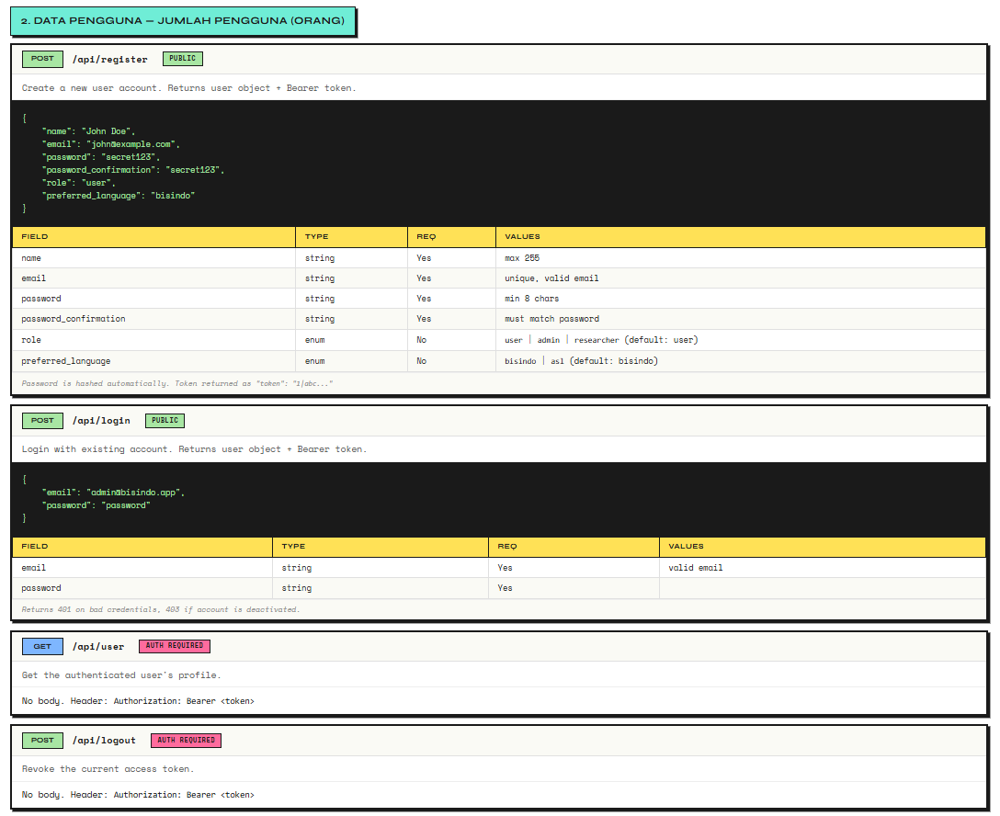 | 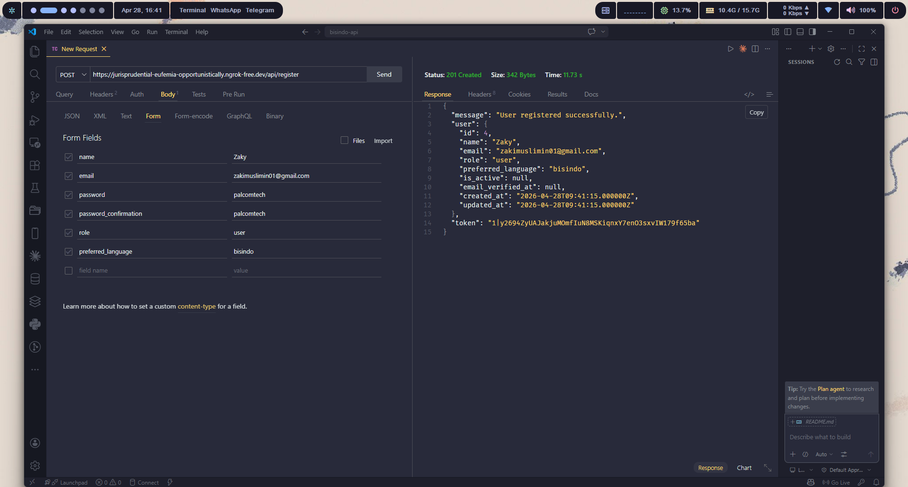 |

---

### Health & Dashboard

| Method | Endpoint | Deskripsi |
|--------|----------|-----------|
| `GET` | `/api/health` | Health check, mengembalikan status aplikasi |
| `GET` | `/api/dashboard/stats` | Statistik agregat untuk semua 9 variabel |

---

### 1. Gestur Tangan

Satuan: Jumlah gestur (buah/item)

| Method | Endpoint | Deskripsi |
|--------|----------|-----------|
| `GET` | `/api/gestures` | Daftar gestur |
| `POST` | `/api/gestures` | Buat satu gestur |
| `POST` | `/api/gestures/bulk` | Import gestur secara massal (untuk pipeline ML) |
| `GET` | `/api/gestures/{id}` | Detail gestur |
| `DELETE` | `/api/gestures/{id}` | Hapus gestur |

Query params: `?vocabulary_id=1`, `?gesture_type=static|dynamic`, `?source_dataset=asl_alphabet_kaggle`, `?hand=left|right|both`

#### POST `/api/gestures` -- Payload

```json
{
  "vocabulary_id": 1,
  "landmarks": [[0.5, 0.3, 0.0], [0.6, 0.4, 0.1]],
  "hand": "right",
  "gesture_type": "static",
  "frame_count": 1,
  "confidence_score": 0.95,
  "source_dataset": "bisindo-v1",
  "contributor_id": "user-001"
}
```

| Field | Tipe | Wajib | Nilai |
|-------|------|-------|-------|
| `vocabulary_id` | int | Ya | FK `sign_vocabularies` |
| `landmarks` | array | Ya | Data MediaPipe 21-point |
| `hand` | enum | Tidak | `left` \| `right` \| `both` |
| `gesture_type` | enum | Tidak | `static` \| `dynamic` |
| `frame_count` | int | Tidak | min 1 |
| `landmark_sequence` | array | Tidak | Untuk dynamic (array of frames) |
| `confidence_score` | float | Tidak | 0.0 - 1.0 |
| `source_dataset` | string | Tidak | maks 255 |
| `contributor_id` | string | Tidak | maks 255 |

#### POST `/api/gestures/bulk` -- Payload

```json
{
  "gestures": [
    { "vocabulary_id": 1, "landmarks": [[0.5,0.3,0.0]], "hand": "right", "gesture_type": "static" },
    { "vocabulary_id": 2, "landmarks": [[0.6,0.4,0.1]], "hand": "left", "gesture_type": "static" }
  ]
}
```

**Referensi endpoint dan demo pengujian:**

| Referensi API | Demo via Thunder Client |
|:---:|:---:|
| 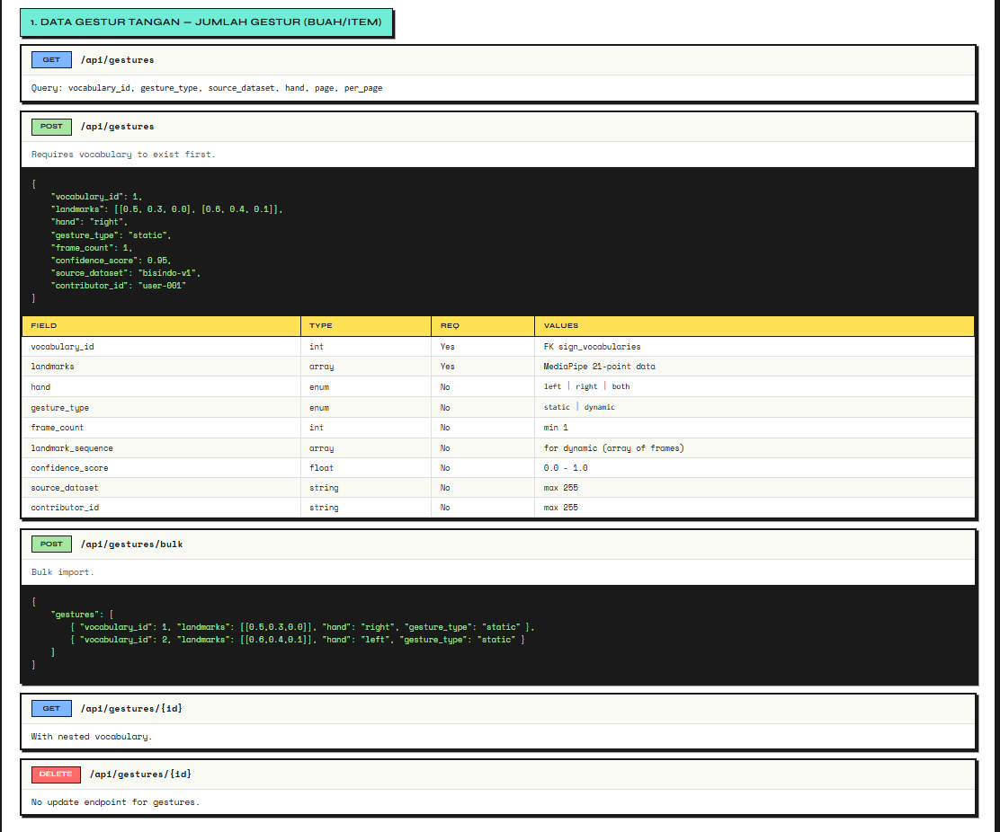 | 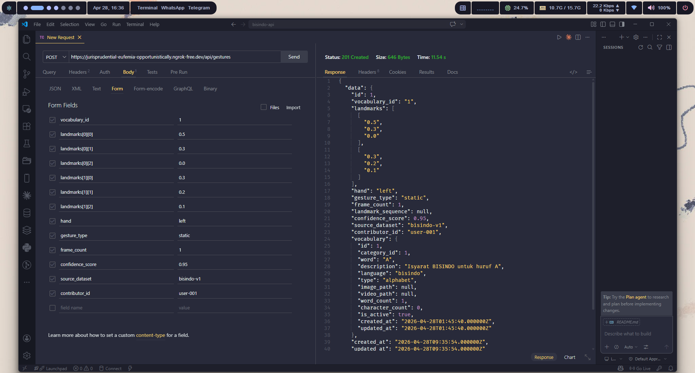 |

---

### 2. Data Pengguna

Satuan: Jumlah pengguna (orang)

Pengguna dibuat melalui endpoint `POST /api/register` (lihat bagian [Autentikasi](#autentikasi-sanctum)).

Akun bawaan tersedia setelah menjalankan `php artisan migrate --seed`:

| Email | Role | Password |
|-------|------|----------|
| `admin@bisindo.app` | `admin` | `password` |
| `researcher@bisindo.app` | `researcher` | `password` |
| `test@bisindo.app` | `user` | `password` |

---

### 3. Kategori Kosakata

Satuan: Jumlah kategori (kategori)

| Method | Endpoint | Deskripsi |
|--------|----------|-----------|
| `GET` | `/api/categories` | Daftar semua kategori |
| `POST` | `/api/categories` | Buat kategori |
| `GET` | `/api/categories/{id}` | Detail kategori beserta kosakata |
| `PUT` | `/api/categories/{id}` | Perbarui kategori |
| `DELETE` | `/api/categories/{id}` | Hapus kategori (cascade ke kosakata) |

Query params: `?language=bisindo|asl`, `?active_only=true|false`

#### POST `/api/categories` -- Payload

```json
{
  "name": "Alfabet",
  "slug": "alfabet",
  "description": "Huruf A-Z dalam BISINDO",
  "language": "bisindo",
  "sort_order": 1,
  "is_active": true
}
```

| Field | Tipe | Wajib | Nilai |
|-------|------|-------|-------|
| `name` | string | Ya | maks 255 |
| `slug` | string | Ya | unik, maks 255 |
| `description` | string | Tidak | -- |
| `language` | enum | Ya | `bisindo` \| `asl` |
| `sort_order` | int | Tidak | min 0 |
| `is_active` | bool | Tidak | default `true` |

**Referensi endpoint dan demo pengujian:**

| Referensi API | Demo via Thunder Client |
|:---:|:---:|
| 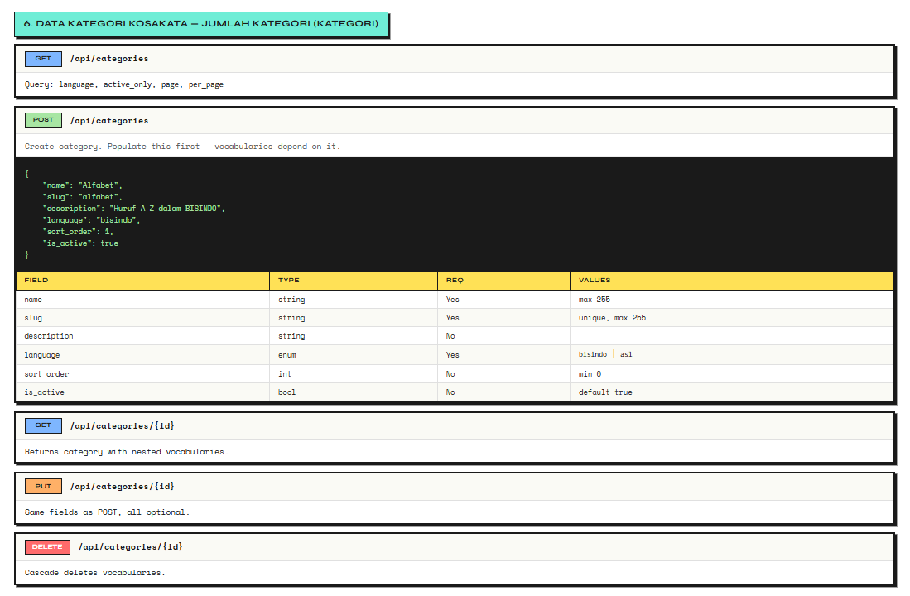 | 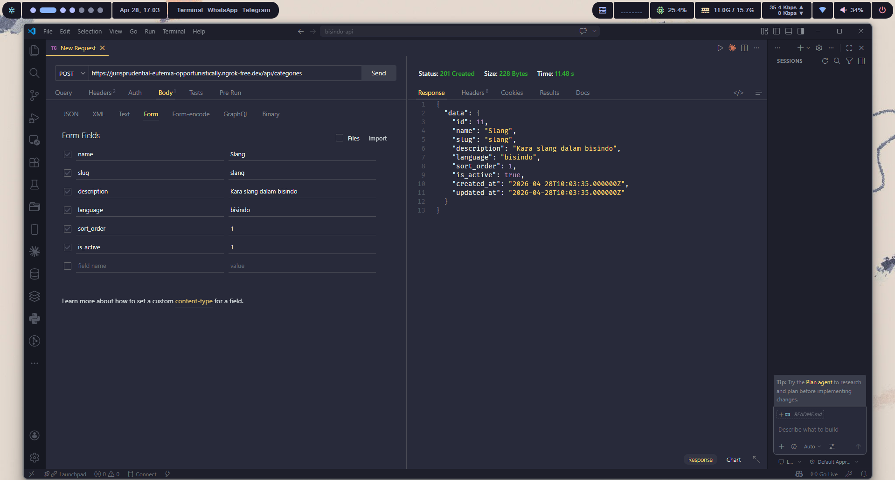 |

---

### 4. Kosakata Bahasa Isyarat

Satuan: Jumlah kata (kata/item)

| Method | Endpoint | Deskripsi |
|--------|----------|-----------|
| `GET` | `/api/vocabularies` | Daftar kosakata (paginasi) |
| `POST` | `/api/vocabularies` | Buat entri kosakata |
| `GET` | `/api/vocabularies/{id}` | Detail kosakata beserta gestur, terjemahan, audio |
| `PUT` | `/api/vocabularies/{id}` | Perbarui kosakata |
| `DELETE` | `/api/vocabularies/{id}` | Hapus kosakata (cascade ke gestur, terjemahan) |

Query params: `?language=bisindo|asl`, `?type=alphabet|number|word|phrase`, `?category_id=1`, `?search=halo`, `?per_page=50`

#### POST `/api/vocabularies` -- Payload

```json
{
  "category_id": 1,
  "word": "A",
  "description": "Huruf A dalam BISINDO",
  "language": "bisindo",
  "type": "alphabet",
  "is_active": true
}
```

| Field | Tipe | Wajib | Nilai |
|-------|------|-------|-------|
| `category_id` | int | Ya | FK `vocabulary_categories` |
| `word` | string | Ya | maks 255 |
| `description` | string | Tidak | -- |
| `language` | enum | Ya | `bisindo` \| `asl` |
| `type` | enum | Ya | `alphabet` \| `number` \| `word` \| `phrase` |
| `image_path` | string | Tidak | -- |
| `video_path` | string | Tidak | -- |
| `is_active` | bool | Tidak | default `true` |

> `word_count` dan `character_count` dihitung otomatis dari field `word`.

**Referensi endpoint dan demo pengujian:**

| Referensi API | Demo via Thunder Client |
|:---:|:---:|
| 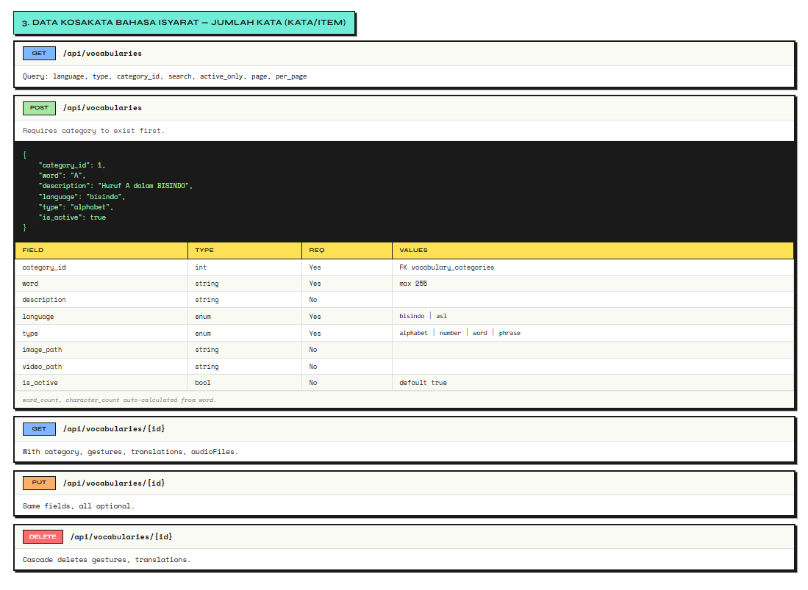 | 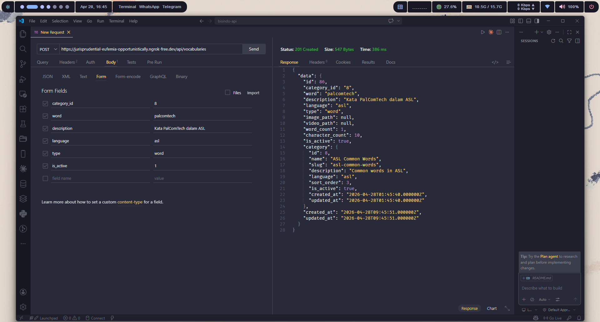 |

---

### 5. Terjemahan Teks

Satuan: Jumlah karakter/kata (string)

| Method | Endpoint | Deskripsi |
|--------|----------|-----------|
| `GET` | `/api/translations` | Daftar terjemahan |
| `POST` | `/api/translations` | Buat terjemahan |
| `PUT` | `/api/translations/{id}` | Perbarui terjemahan |
| `DELETE` | `/api/translations/{id}` | Hapus terjemahan |

Query params: `?vocabulary_id=1`, `?source_language=id`, `?target_language=en`

#### POST `/api/translations` -- Payload

```json
{
  "vocabulary_id": 1,
  "source_language": "id",
  "target_language": "en",
  "source_text": "Halo",
  "translated_text": "Hello"
}
```

| Field | Tipe | Wajib | Nilai |
|-------|------|-------|-------|
| `vocabulary_id` | int | Ya | FK `sign_vocabularies` |
| `source_language` | string | Ya | maks 10 |
| `target_language` | string | Ya | maks 10 |
| `source_text` | string | Ya | -- |
| `translated_text` | string | Ya | -- |

> `character_count` dihitung otomatis dari `translated_text`.

**Referensi endpoint dan demo pengujian:**

| Referensi API | Demo via Thunder Client |
|:---:|:---:|
| 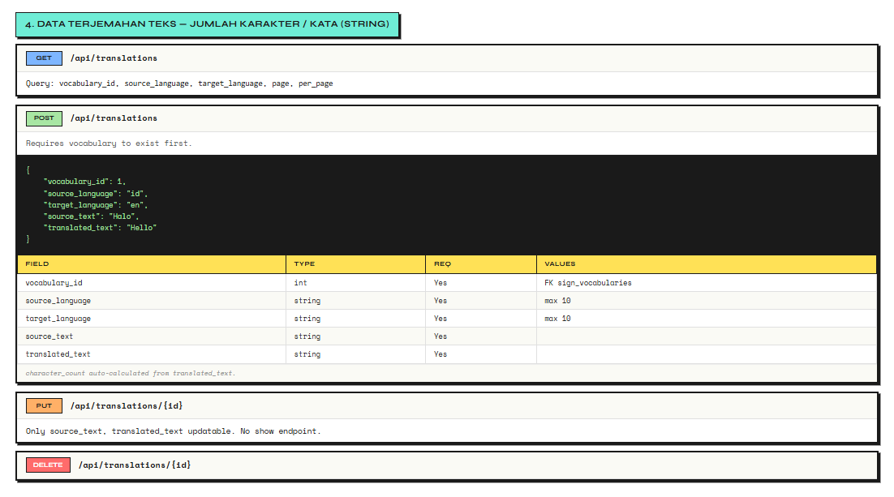 | 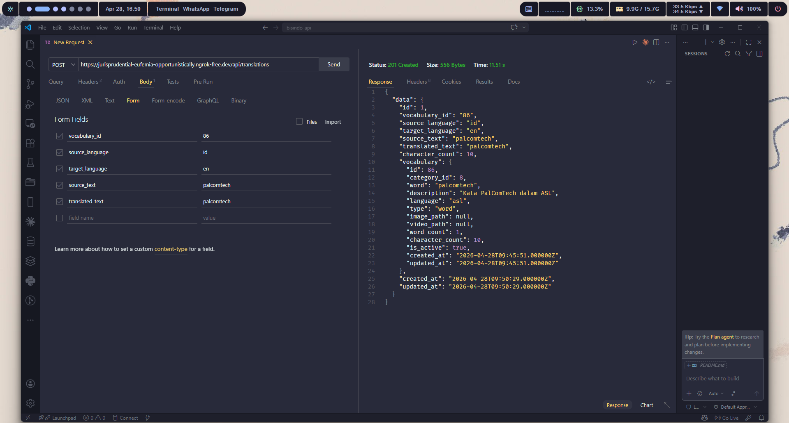 |

---

### 6. File Audio

Satuan: Durasi (detik) / Ukuran file (MB)

| Method | Endpoint | Deskripsi |
|--------|----------|-----------|
| `GET` | `/api/audio` | Daftar file audio |
| `POST` | `/api/audio` | Upload file audio (multipart form) |
| `GET` | `/api/audio/{id}` | Metadata file audio |
| `DELETE` | `/api/audio/{id}` | Hapus file audio |

Query params: `?vocabulary_id=1`, `?language=id`, `?type=tts_output|stt_input|reference`

#### POST `/api/audio` -- Payload (Form Data)

```
file:            [pilih file] (wav/mp3/ogg/m4a, maks 10MB)
vocabulary_id:   1
language:        id
transcript:      Halo
type:            reference
```

| Field | Tipe | Wajib | Nilai |
|-------|------|-------|-------|
| `file` | file | Ya | wav, mp3, ogg, m4a / maks 10MB |
| `vocabulary_id` | int | Tidak | FK `sign_vocabularies` |
| `language` | string | Tidak | maks 10, default `id` |
| `transcript` | string | Tidak | -- |
| `type` | enum | Tidak | `tts_output` \| `stt_input` \| `reference` |

> `duration_seconds` dan `file_size_mb` dihitung otomatis.

**Referensi endpoint dan demo pengujian:**

| Referensi API | Demo via Thunder Client |
|:---:|:---:|
| 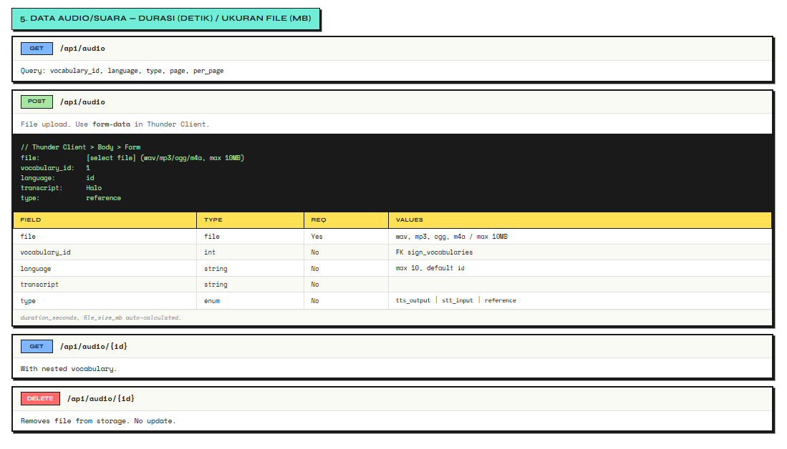 | 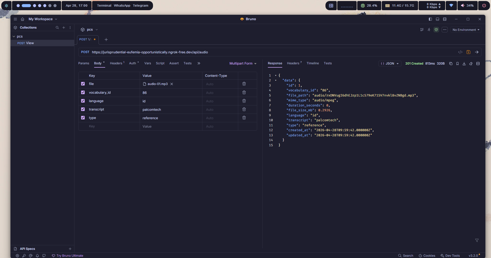 |

---

### 7. Riwayat Terjemahan

Satuan: Jumlah sesi (sesi/log)

| Method | Endpoint | Deskripsi |
|--------|----------|-----------|
| `GET` | `/api/history` | Daftar riwayat terjemahan |
| `POST` | `/api/history` | Catat event terjemahan |
| `GET` | `/api/history/{id}` | Detail riwayat beserta feedback |

Query params: `?user_id=1`, `?session_id=abc`, `?direction=sign_to_text|text_to_sign|speech_to_text|text_to_speech`

#### POST `/api/history` -- Payload

```json
{
  "session_id": "sess-001",
  "direction": "sign_to_text",
  "input_data": "[landmark array]",
  "output_data": "Halo",
  "input_language": "bisindo",
  "output_language": "id",
  "confidence_score": 0.92,
  "duration_seconds": 1.5,
  "is_correct": true
}
```

| Field | Tipe | Wajib | Nilai |
|-------|------|-------|-------|
| `user_id` | int | Tidak | FK `users` |
| `session_id` | string | Ya | maks 255 |
| `direction` | enum | Ya | `sign_to_text` \| `text_to_sign` \| `speech_to_text` \| `text_to_speech` |
| `input_data` | string | Tidak | -- |
| `output_data` | string | Tidak | -- |
| `input_language` | enum | Ya | `bisindo` \| `asl` \| `id` \| `en` |
| `output_language` | enum | Ya | `bisindo` \| `asl` \| `id` \| `en` |
| `confidence_score` | float | Tidak | 0.0 - 1.0 |
| `duration_seconds` | float | Tidak | min 0 |
| `is_correct` | bool | Tidak | -- |

**Referensi endpoint dan demo pengujian:**

| Referensi API | Demo via Thunder Client |
|:---:|:---:|
| 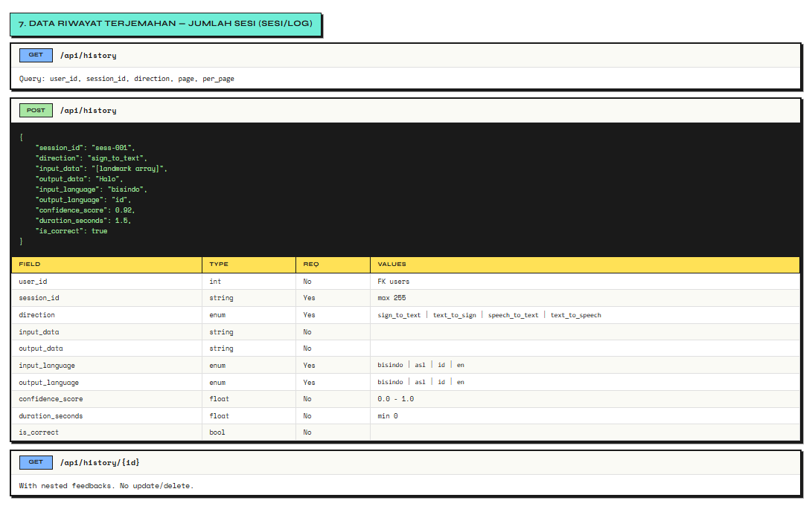 | 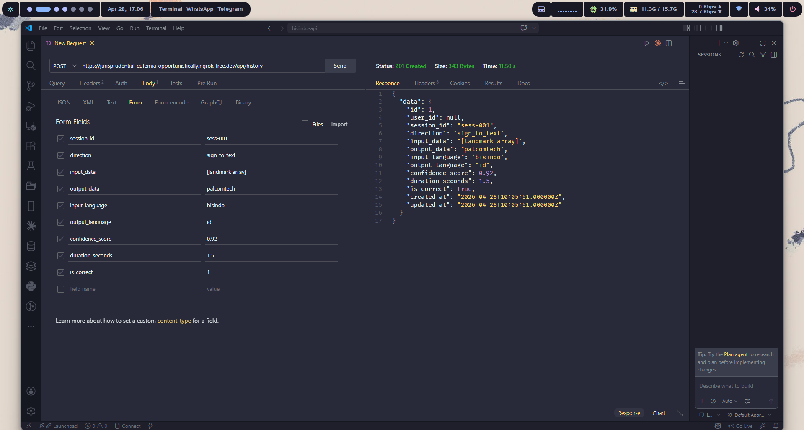 |

---

### 8. Model AI/ML

Satuan: Tingkat akurasi (%)

| Method | Endpoint | Deskripsi |
|--------|----------|-----------|
| `GET` | `/api/models` | Daftar semua model |
| `POST` | `/api/models` | Daftarkan model baru |
| `GET` | `/api/models/{id}` | Detail model + akurasi feedback |
| `PUT` | `/api/models/{id}` | Perbarui metadata/metrik model |
| `DELETE` | `/api/models/{id}` | Hapus model |
| `POST` | `/api/models/{id}/upload` | Upload file .tflite (maks 100MB) |
| `POST` | `/api/models/{id}/deploy` | Deploy model (otomatis arsipkan versi sebelumnya) |

Query params: `?type=alphabet_classifier|word_classifier|stt_model|tts_model`, `?language=bisindo|asl`, `?status=training|validating|ready|deployed|archived`, `?deployed_only=true`

#### POST `/api/models` -- Payload

```json
{
  "name": "bisindo-alphabet-cnn",
  "version": "1.0.0",
  "type": "alphabet_classifier",
  "language": "bisindo",
  "accuracy_percent": 94.5,
  "num_classes": 26,
  "training_samples": 5000,
  "validation_samples": 1000,
  "training_config": { "epochs": 50, "batch_size": 32 },
  "metrics": { "precision": 0.94, "recall": 0.93 },
  "status": "ready",
  "notes": "Trained on BISINDO alphabet dataset v1"
}
```

| Field | Tipe | Wajib | Nilai |
|-------|------|-------|-------|
| `name` | string | Ya | maks 255 |
| `version` | string | Ya | maks 50 |
| `type` | enum | Ya | `alphabet_classifier` \| `word_classifier` \| `stt_model` \| `tts_model` |
| `language` | enum | Ya | `bisindo` \| `asl` \| `id` \| `en` \| `universal` |
| `accuracy_percent` | float | Tidak | 0 - 100 |
| `num_classes` | int | Tidak | min 1 |
| `training_samples` | int | Tidak | min 0 |
| `validation_samples` | int | Tidak | min 0 |
| `training_config` | object | Tidak | JSON |
| `metrics` | object | Tidak | JSON |
| `status` | enum | Tidak | `training` \| `validating` \| `ready` \| `deployed` \| `archived` |
| `is_active` | bool | Tidak | default `false` |
| `notes` | string | Tidak | -- |

**Referensi endpoint dan demo pengujian:**

| Referensi API | Demo via Thunder Client |
|:---:|:---:|
| 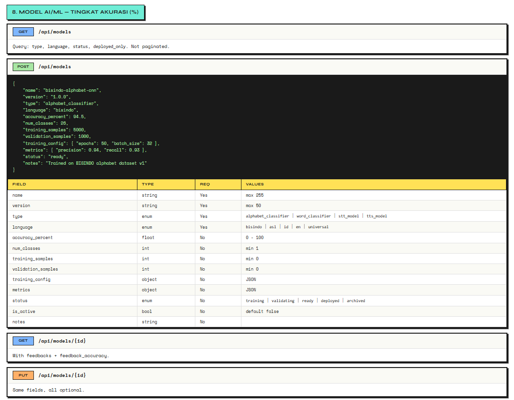 | 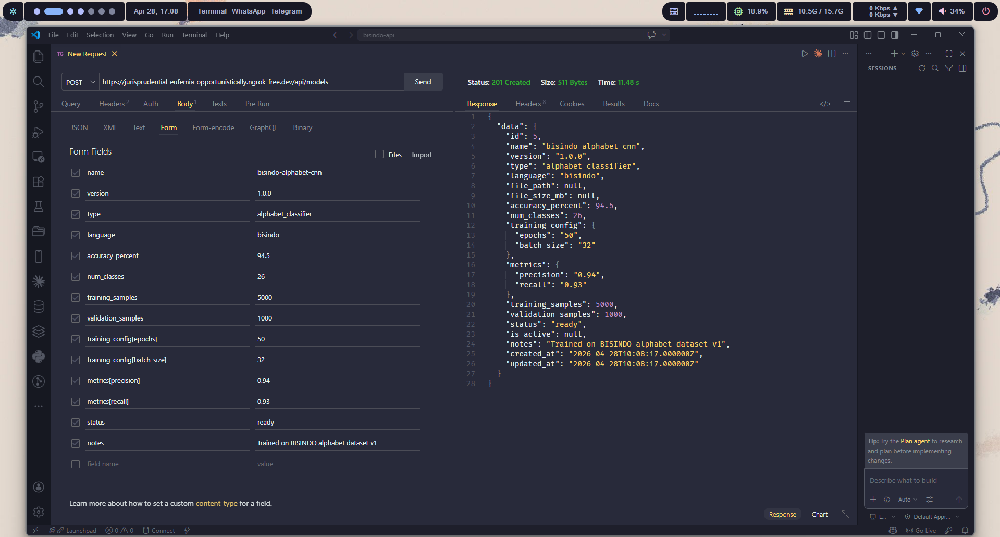 |

---

### 9. Feedback Pengguna

Satuan: Jumlah respons (benar/salah)

| Method | Endpoint | Deskripsi |
|--------|----------|-----------|
| `GET` | `/api/feedbacks` | Daftar feedback |
| `POST` | `/api/feedbacks` | Kirim feedback |
| `GET` | `/api/feedbacks/{id}` | Detail feedback |

Query params: `?user_id=1`, `?ai_model_id=1`, `?type=correction|rating|bug_report|suggestion`, `?is_correct=true|false`

#### POST `/api/feedbacks` -- Payload

```json
{
  "translation_history_id": 1,
  "ai_model_id": 1,
  "type": "correction",
  "is_correct": false,
  "expected_output": "B",
  "rating": 3,
  "comment": "Model memprediksi A tetapi isyarat sebenarnya B"
}
```

| Field | Tipe | Wajib | Nilai |
|-------|------|-------|-------|
| `user_id` | int | Tidak | FK `users` |
| `translation_history_id` | int | Tidak | FK `translation_histories` |
| `ai_model_id` | int | Tidak | FK `ai_models` |
| `type` | enum | Ya | `correction` \| `rating` \| `bug_report` \| `suggestion` |
| `is_correct` | bool | Tidak | -- |
| `expected_output` | string | Tidak | -- |
| `rating` | int | Tidak | 1 - 5 |
| `comment` | string | Tidak | -- |
| `metadata` | object | Tidak | JSON |

**Referensi endpoint dan demo pengujian:**

| Referensi API | Demo via Thunder Client |
|:---:|:---:|
| 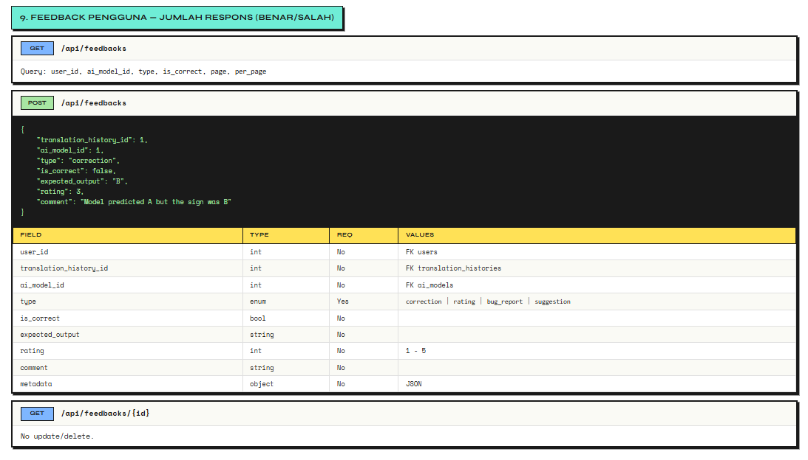 | 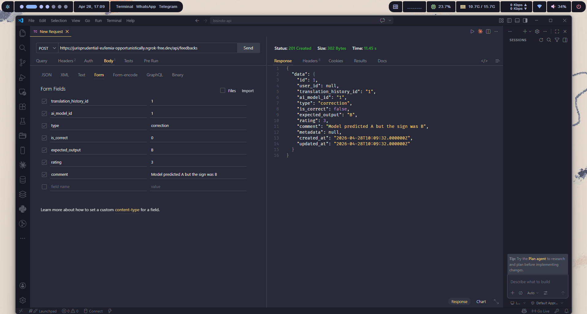 |

---

## Urutan Populate Data

Data memiliki dependensi foreign key. Isi data sesuai urutan berikut:

| Urutan | Endpoint | Keterangan |
|--------|----------|------------|
| 1 | `POST /api/register` | Buat akun pengguna (atau gunakan akun bawaan) |
| 2 | `POST /api/login` | Dapatkan Bearer token untuk endpoint terproteksi |
| 3 | `POST /api/categories` | Buat kategori terlebih dahulu |
| 4 | `POST /api/vocabularies` | Membutuhkan `category_id` |
| 5 | `POST /api/gestures` | Membutuhkan `vocabulary_id` |
| 6 | `POST /api/translations` | Membutuhkan `vocabulary_id` |
| 7 | `POST /api/audio` | Membutuhkan `vocabulary_id` (opsional) |
| 8 | `POST /api/models` | Independen |
| 9 | `POST /api/history` | Membutuhkan `user_id` (opsional) |
| 10 | `POST /api/feedbacks` | Membutuhkan `translation_history_id` / `ai_model_id` |

**Konfigurasi Thunder Client / Bruno:**

1. Environment variable: `base_url` = `https://xxxx.ngrok-free.app/api`
2. Header pada semua request:
   - `Accept: application/json`
   - `Content-Type: application/json` (untuk body JSON)
   - `ngrok-skip-browser-warning: true`
   - `Authorization: Bearer <token>` (untuk endpoint terproteksi)
3. Upload file (audio, model) menggunakan Body > Form (bukan JSON)

---

## Struktur Proyek

```
isyarat-app-core/
├── seed_data.py                         # Script Python untuk seeding data via API
├── app/
│   ├── Http/
│   │   ├── Controllers/
│   │   │   ├── Api/
│   │   │   │   ├── AiModelController.php
│   │   │   │   ├── AudioFileController.php
│   │   │   │   ├── AuthController.php
│   │   │   │   ├── DashboardController.php
│   │   │   │   ├── HandGestureController.php
│   │   │   │   ├── SignVocabularyController.php
│   │   │   │   ├── TextTranslationController.php
│   │   │   │   ├── TranslationHistoryController.php
│   │   │   │   ├── UserFeedbackController.php
│   │   │   │   └── VocabularyCategoryController.php
│   │   │   └── Web/
│   │   │       └── DashboardController.php
│   │   └── Resources/                  # JSON response transformers
│   └── Models/
│       ├── AiModel.php
│       ├── AudioFile.php
│       ├── HandGesture.php
│       ├── SignVocabulary.php
│       ├── TextTranslation.php
│       ├── TranslationHistory.php
│       ├── User.php
│       ├── UserFeedback.php
│       └── VocabularyCategory.php
├── database/
│   ├── database.sqlite                  # File database SQLite
│   ├── factories/
│   │   └── UserFactory.php
│   ├── migrations/                      # File migrasi
│   └── seeders/
│       ├── DatabaseSeeder.php
│       ├── VocabularyCategorySeeder.php
│       ├── SignVocabularySeeder.php
│       └── AiModelSeeder.php
├── routes/
│   ├── api.php                          # Definisi route API
│   └── web.php                          # Route web (dashboard)
├── storage/app/public/
│   ├── audio/                           # File audio yang diupload
│   └── models/                          # File model .tflite
└── .env                                 # Konfigurasi environment
```

---

## Perintah Umum

| Perintah | Fungsi |
|----------|--------|
| `php artisan serve --port=8000` | Jalankan server development |
| `php artisan migrate` | Jalankan migrasi database |
| `php artisan migrate:fresh --seed` | Reset dan seed ulang seluruh database |
| `php artisan route:list --path=api` | Tampilkan semua route API |
| `php artisan optimize:clear` | Bersihkan semua cache |
| `php artisan tinker` | Buka database REPL |

---

## Alur Kerja Pipeline ML

Alur kerja umum untuk tim ML:

| Langkah | Aksi | Endpoint |
|---------|------|----------|
| 1 | Daftarkan model | `POST /api/models` dengan name, version, type, language, training config |
| 2 | Latih model | Gunakan training scripts di direktori `training/` (repo terpisah) |
| 3 | Perbarui metrik | `PUT /api/models/{id}` dengan accuracy, precision, recall, jumlah sampel |
| 4 | Upload file .tflite | `POST /api/models/{id}/upload` |
| 5 | Deploy | `POST /api/models/{id}/deploy` (otomatis arsipkan model aktif sebelumnya) |
| 6 | Kumpulkan feedback | Aplikasi mengirim `POST /api/feedbacks` dengan `is_correct: true/false` |
| 7 | Pantau akurasi | `GET /api/dashboard/stats` menampilkan akurasi berbasis feedback |

### Import Data Gestur Secara Massal

Untuk bulk import data landmark dari dataset (ASL Alphabet Kaggle, Roboflow BISINDOv2, dll):

```bash
curl -X POST http://127.0.0.1:8000/api/gestures/bulk \
  -H "Content-Type: application/json" \
  -H "Accept: application/json" \
  -d @landmarks_batch.json
```

Format file `landmarks_batch.json`:

```json
{
  "gestures": [
    {
      "vocabulary_id": 1,
      "landmarks": [0.0, 0.1, 0.2, "... 126 normalized floats (21 landmarks x 3 coords x 2 hands)"],
      "hand": "both",
      "gesture_type": "static",
      "frame_count": 1,
      "source_dataset": "asl_alphabet_kaggle"
    }
  ]
}
```

Untuk gestur dinamis (level kata), sertakan `landmark_sequence` (array of frames, masing-masing 108 float untuk hands+body):

```json
{
  "vocabulary_id": 37,
  "landmarks": [0.0, 0.1, "... ringkasan frame pertama"],
  "hand": "both",
  "gesture_type": "dynamic",
  "frame_count": 60,
  "landmark_sequence": [
    [0.0, 0.1, "... 108 floats untuk frame 1"],
    [0.0, 0.1, "... 108 floats untuk frame 2"],
    "... hingga 60 frame"
  ],
  "source_dataset": "wl_bisindo_32words"
}
```

---

## Catatan

- **Endpoint autentikasi** (`/api/register`, `/api/login`, `/api/logout`, `/api/user`) tersedia melalui Sanctum. Sebagian besar endpoint resource tetap publik untuk fase pengembangan awal.
- **SQLite** digunakan untuk kemudahan. File database berada di `database/database.sqlite`. Untuk reset, hapus file tersebut dan jalankan ulang `php artisan migrate --seed`.
- **Upload file** (audio, model) disimpan di `storage/app/public/`. Symlink publik menyajikannya di `/storage/`.
- Kosakata BISINDO di-seed dari referensi `app_disabilitas` (49 entri: 26 alfabet + 10 angka + 13 kata umum).
